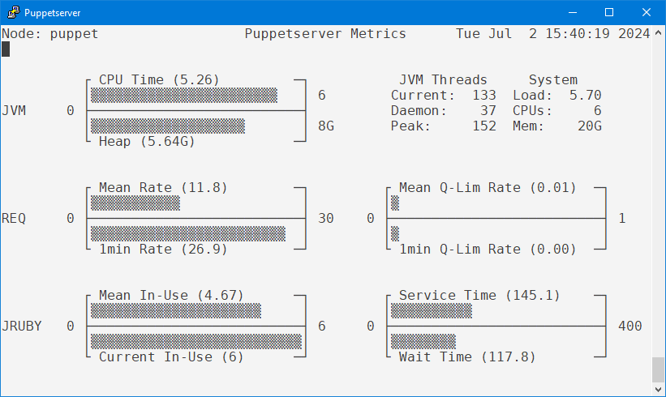

# Puppet Server Metrics

This Python3 script uses the [Puppet Server V2 metrics API](https://www.puppet.com/docs/puppet/8/server/metrics-api/v2/metrics_api.html) to repeatedly show performance metrics of your Puppetserver. The curses library is used to present the metrics using ASCII graphics in a terminal window.

This script might be useful for consultants visiting a Customer to investigate suspected performance problems with the Puppetserver. It only needs a default Python interpreter and provides graphical monitoring without any additional software installation. But it can of course be used by every other puppeteer as well. See the following screenshot for an example output.



*Fun Fact*: If the appearance of the output looks familiar to you, then you are probably old enough to have worked with the VAX/VMS respectively OpenVMS operating system: the layout of the metric panels has been inspired by the VMS `MONITOR SYSTEM` utility.

## Installation and configuration

The script requires a modern Python 3.x interpreter. All required modules are part of the Python core and no additional packages need to be installed.

The Puppetserver API uses a client certificate for authentication. So the script will need access to a certificate issued by the Puppetserver to run. There are two ways this can be achieved. Running the script as root is simpler while running as ordinary user is more secure.

### Running the script as root

Running the script as `root` is possible. The certificate issued for the Puppet Agent will be used if that is available and readable by the current user. This might be the easiest way to quickly test the script.

### Running the script as ordinary user

If you plan to use the script as ordinary user, then you will have to create a new client certificate and have it signed by the Puppetserver. You can create a personal certification request by running the following two command:

``` shell
$ mkdir -p ~/.puppetlabs/opt/puppet/cache/devices
$ puppet ssl bootstrap --verbose --server puppet.example.com --waitforcert 600 --target $USER
```

Obviously you will need to replace `puppet.example.com` with the name of your Puppetserver. The environment variable `$USER` is used to define the name of the certificate. If you like to use a different name, you can set that here instead. But then you will have to rename the generated files as described below.

The command will wait for 10 minutes until the certificate signing request is signed.

The next step will have to be performed as `root` on the Puppetserver. Your personal certificate signing request should be show when running the `puppetserver ca list` command. You must sign the request using the name given in the `puppet ssl bootstrap` command (my username is `stm`):

``` shell
# puppetserver ca list
# puppetserver ca sign --certname stm
```

After that the initial command should complete and generate the required files. The key and certificate will be named using the target provided in the first command so in my case I get the following files:

```
/home/stm/.puppetlabs/etc/puppet/ssl/certs/ca.pem
/home/stm/.puppetlabs/etc/puppet/ssl/certs/stm.pem
/home/stm/.puppetlabs/etc/puppet/ssl/private_keys/stm.pem
```

The script will use your username to access the files so if you used a different target name in the first command, you will have to rename the generated files to match the names here (replace `stm` with your username).

Now you are set to run the script using your personal account.

### Prepare the Puppetserver

The API endpoint is normally disabled. Use the following steps to enable it.

Locate the authentication configuration of your Puppetserver. For Linux this should be the file `/etc/puppetlabs/puppetserver/conf.d/auth.conf`. Make a backup copy of this file in case you need to revert to the old configuration.

The file uses the HOCON format, which is a superset of [JSON](https://en.wikipedia.org/wiki/JSON). It contains an array of objects that describe the access rules for the server.

The last rule should have the name `puppetlabs deny all` that blocks all requests not allowed by the preceding rules. Add the following block just before the last block:

``` hocon
{
	match-request: {
		path: "/metrics/v2"
		type: path
		method: [get, post]
	}
	allow: "*"
	sort-order: 500
	name: "puppet metrics information"
},
```

Take care to keep the braces balanced. Also note the trailing comma after the closing brace since this object is part of the rule array and the final array element should be the deny rule.

Save the file and restart the Puppetserver. Check for errors in the Puppetserver log file in case of startup failures.
